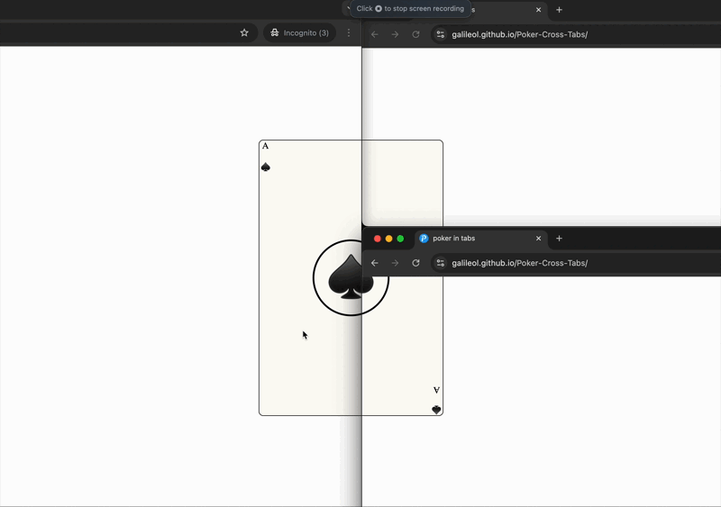

# PokerInTabs

A simple web app that displays a draggable poker card and synchronizes its position across browser tabs using the BroadcastChannel API.

## Demo

[Live Demo](https://galileol.github.io/Poker-Cross-Tabs/)



---

一个简单的网页应用，展示可拖动的扑克牌，并通过 BroadcastChannel API 在多个浏览器标签页间同步其位置。

## Features / 功能

- Drag the poker card to move it around the screen
- Card position is synchronized in real-time across all open tabs
- Modern, responsive UI

- 拖动扑克牌在屏幕上移动
- 扑克牌位置会在所有打开的标签页间实时同步
- 现代化、响应式界面

## Usage / 使用方法

1. Open `index.html` in your browser
2. Drag the card to move it
3. Open the page in another tab to see position sync

4. 在浏览器中打开 `index.html`
5. 拖动扑克牌进行移动
6. 在另一个标签页打开页面，可看到位置同步效果

## Project Structure / 项目结构

```
index.html         # Main HTML file
main.js            # JavaScript logic for drag & sync
style.css          # Card and layout styles
public/            # Icons and manifest
```

## License / 许可证

MIT
